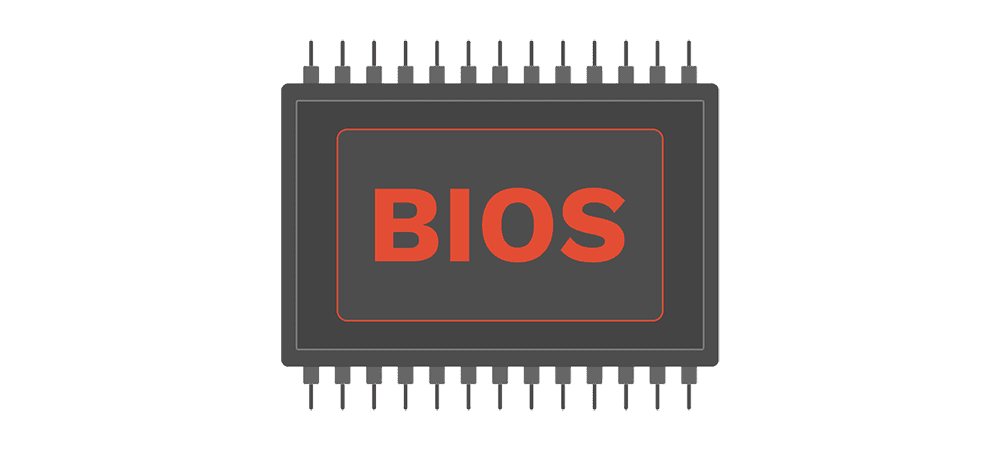
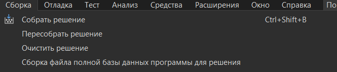

BIOS_clone
---
🖥Program based on BIOS to help people to understand BIOS, written on cpp

---
🔨Building
---

---
 
 
 
🎴Overview
---

---
📲Contacts
---
__Discord: 𝔰𝔦𝔩𝔳𝔢𝔯 𝔰𝔥𝔞𝔡𝔬𝔴#5304__

---
[go up](#up)
